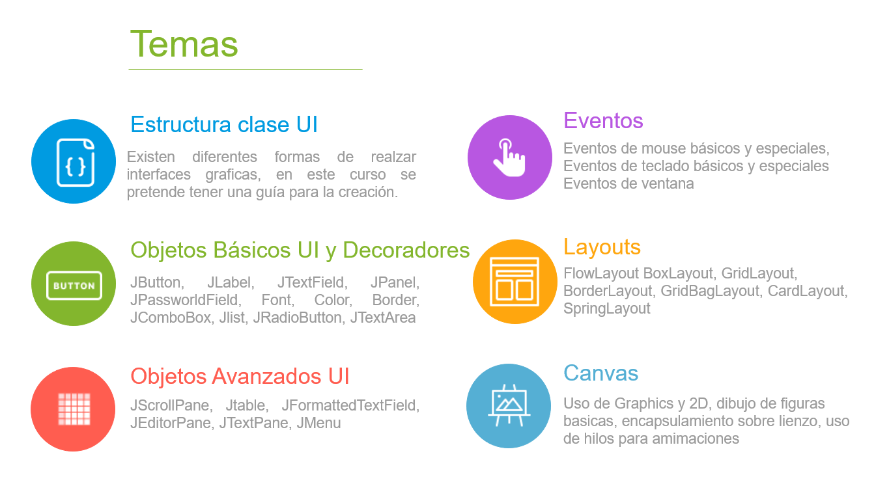
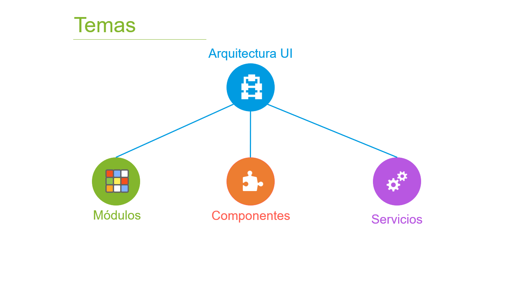
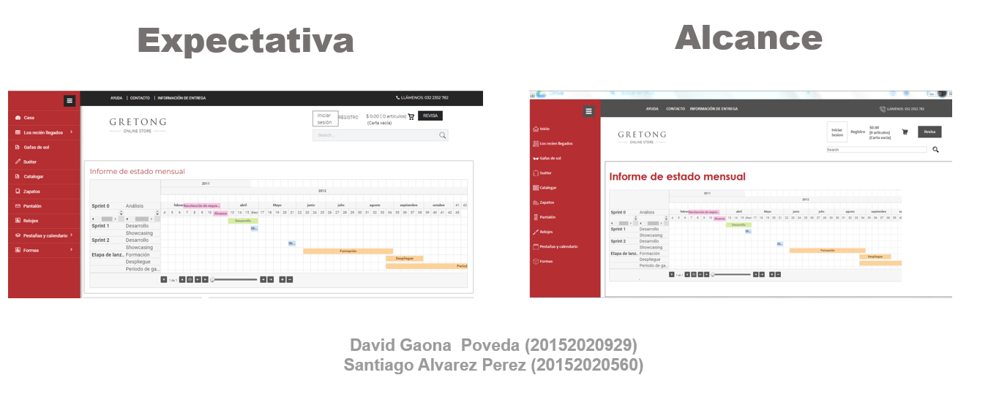
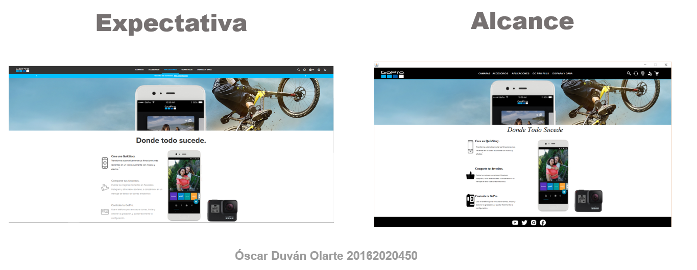
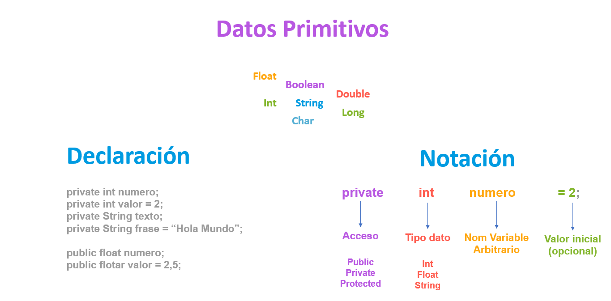
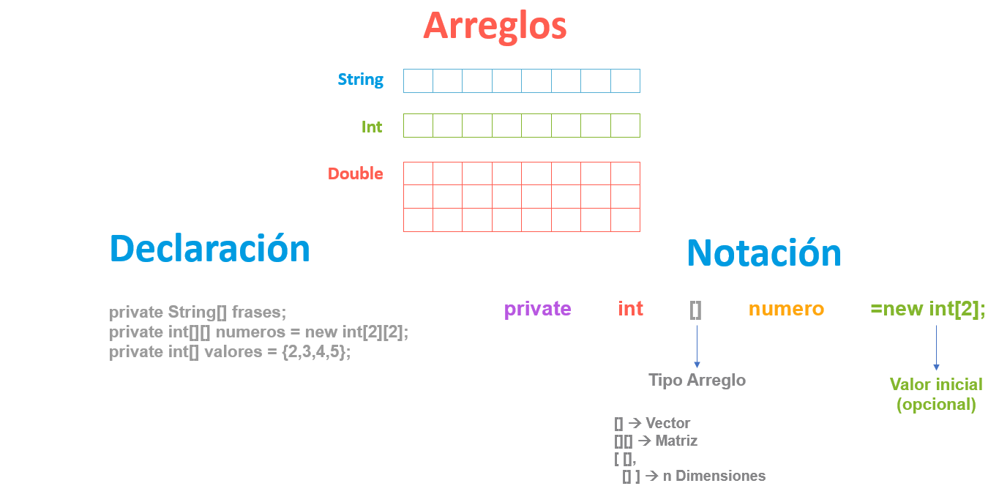
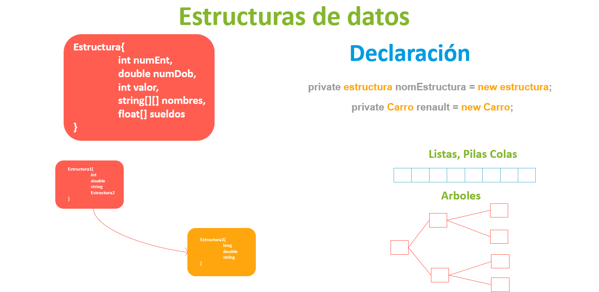
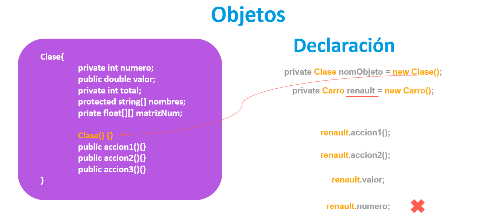
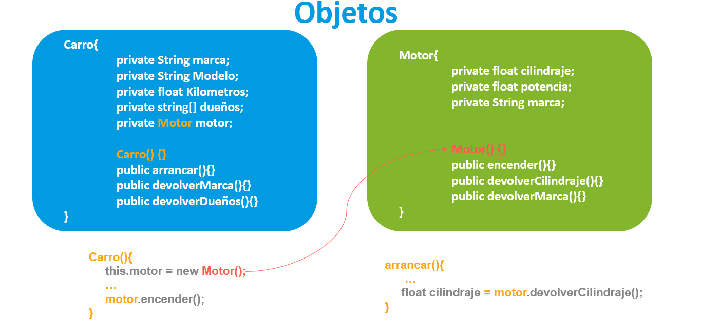
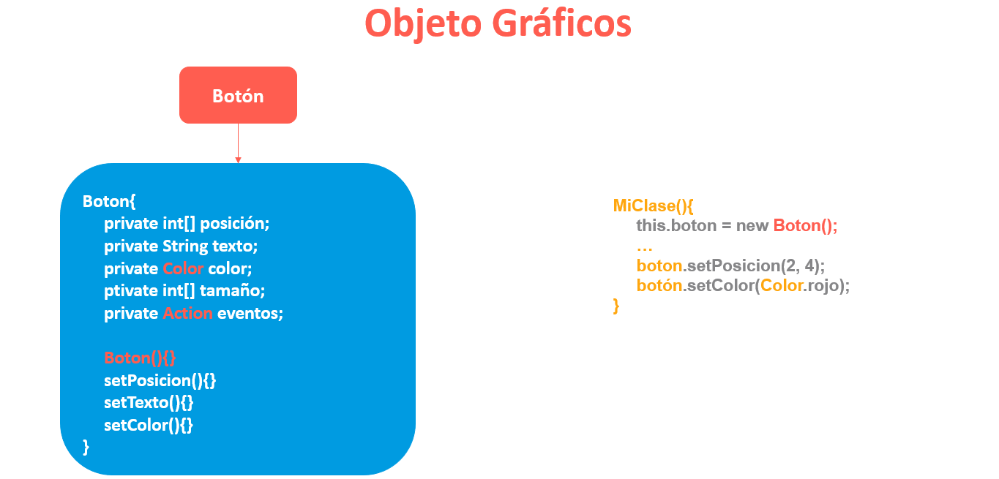

# Interfaz Grafica en Java

Curso propuesto por el grupo de trabajo Semana de Ingenio y Diseño (**SID**) de la Universidad Distrital Francisco Jose de Caldas.

## Monitor

**Cristian Felipe Patiño Caceres** - Estudiante de Ingenieria de Sistemas de la Universidad Distrital Francisco Jose de Caldas

# Clase 1

## Objetivos

### Objetivos Principales

- Explicar los temas principales y alcances del curso dejando claro que se quiere obtener al finalizar el curso.

  - Para los estudiantes de la carrera de ingenieria de sistemas se explicara ademas como sera el sistema de notas para la obtencion del grupo de trabajo.

- Explicar Concepto de Objetos y aterrizarlo a Objetos para UI
- Explicar la estructura basica de una clase UI en Java

### Objetivos Secundarios

- Mostrar proyectos destacados realizados por estudiantes que han pasado anteriormente por el curso.
- Mostrar propuestas de trabajo para escoger como proyecto del curso.
- Explicar la conformacion de grupos y eleccion de proyectos
- Realizar un Diagnostico de como se sienten los aspirantes del curso

# Introduccion y Alcance de Curso

## Tematicas

A continuacón se muestran las tematicas que se dictaran en el curso.

  

Aunque las tematicas anteriores son importantes y fundamentales, considero que algo mas importante que se quiere enseñar es la perspectiva de una arquitectura para la construccion de nuestras apicaciones graficas de los clientes.

  

El anterior esquema esta basado en Frameworks y Librerias muy usados en el entorno del desarrollo Frontend y su enfoque da una vision organizada y estandarizada de como trabajar con las aplicaciones cliente. Se busca aterrizar esos conceptos utilizando el lenguaje Java para aplicaciones de escritorio, esto ademas de permitir la creacion de aplicaciones organizadas y estandarizadas ayudará al entendimiento principal de las metodologias que estas propuestas realizan y asi pasar de una manera mas facil a estas tecnologias.

Para los estudiantes que quieren obtener el grupo de trabajo como requisito de la carrera de Ingenieria de Sistemas a continuacion se muestra los porcentajes de notas que se realizaran:

  

## Alcances

A continuación se muestra algunos proyectos realizados por estudiantes que pasaron por el curso anteriormente:

  

  

  

# Definicion de Objeto y Objetos Graficos en Java

Para empezar se va hablar de la evolución de los datos en la programacion para explicar como se forma el concepto de Objetos.

## Datos Primitivos

Primero tenemos los datos Primitivos, estos datos son la parte mas pequeña en cuanto a variables se refiere. Estos son tipos de datos que se encuentran en cualquier lenguaje de programación en la actualidad, en la imagen siguiente se ve alguno de estos mas la forma de declarar (en Java) y su respectiva Notacion.

  

Puede notarse que la declaracion consta de varias partes:

- **Tipo Acceso:** este se refiere a la forma en que los datos pueden obtenerse a traves de otros archivos (clases). Esta propiedad esta enfocada en el paradigma orientado a objetos e indica como las otras clases pueden acceder o no a ciertos atributos o metodos de la clase en construccion. Estos pueden ser:
  - **Publico:** Se puede acceder al atributo desde cualquier otro archivo (Clases).
  - **Privado:** Unicamente se puede acceder al atributo por medio del mismo archivo (Clase).
  - **Protegido:** Solo la clase y las hijas podran acceder al atributo.
- **Tipo de Dato Primitivo:** Simplemente el tipo de dato de toda la vida, puede ser int, String, float, char etc.
- **Variable:** Es el nombre con el que se maneja el tipo de dato, puede tener el nombre que uno decida darle, salvo algunas excepciones como iniciar con numero etc.
- **Valor inicial:** Es el valor que puede tomar una variable una vez se declare, no es necesario que este valor se declare.

## Arreglos

Los datos evolucionan a un concepto mas grande, estos son los arreglos. Los arreglos son colecciones de datos pero estos tienen varias caracteristicas:

- **Unico tipo de dato:** Estos solo pueden contener un tipo de dato, esto quiere decir que si un arreglo contiene n datos estos datos deben ser del mismo tipo dato, por ejemplo un arreglo de enteros no puede contener numeros flotantes, un arreglo de Strings no puede contener numeros etc.
- **Tamaño estatico:** Estos tienen un tamaño inicial y no es posible cambiar el tamaño de este, si un arreglo de enteros inicia con un espacio de 30 tendra esa capacidad y no se puede cambiar.
- **Dimensiones:** Estos pueden tener varias dimensiones que se deben indicar cuando se declara el arreglo y esta dimension tampoco podra ser cambiada.
  - **1 dimension:** Los arreglos de una dimension son conocidos como vectores
  - **2 dimensiones** Los arreglos de 2 dimensiones son conocidos como Matrices
  - **n dimensiones** Los arreglos pueden tener n dimensiones estos arreglos normalmente se entienden como una matriz que contiene matrices o vectores dentro y asi sucesivamente. Java no soporta de forma normal este tipo de arreglos pero en Python por ejemplo es comun trabajar con arreglos de este tipo.

  

Se puede notar que existen varias partes importantes a la hora de declarar que aparecen:

- **Dimension de arreglo:** Se debe denotar la dimension del arreglo con parentesis cuadrados []
- **Inicializacion de Arreglo:** Esta puede ser de varias formas y tampoco es obligatorio realizar en la declaracion sin embaro es importante denotar que una vez se inicializa un arreglo se debe indicar el tamaño que tendra o en efecto el contenido que este tendra.

## Estructuras de datos

Una estructura de datos es un tipo de dato que tiene la capacidad de contener otros datos, a diferencia de un arreglo puede contener datos de diferentes tipos, incluso el concepto es tan amplio que tiene la capacidad de contener arreglos. Otro aspecto importante y que da lugar a un area entera de investigacion es la capacidad que tiene una estructura de datos para contener otra estructura. Esto da la creacion de listas, pilas, colas y arboles.

  

Notece que en la declaracion ha cambiado algo importante:

- **Tipo de dato:** El tipo de dato ya no es convencional, no es una palabra clave del lenguaje (int, String, floar etc.) sino que es un tipo de dato que tendra el nombre de la estructura creada, esto quiere decir que al crear una estructura de datos se esta creando un tipo de dato y se puede manipular mediante una variable. Este concepto se suele llamar como **tipo de dato abstracto**
- **Inicializar estructura:** En Java el concepto de estructuras esta implementado con el conepto de objetos asi que no es posible dejar un ejemplo, sin embargo en lenguajes como C o C++ se puede inicializar como se ve en la imagen.

## Objetos

Los objetos son una extension de las estructuras de datos, estos tienen unas caracteristicas que lo diferencian de estas:

- **Entornos:** un objeto es un conjunto de atributos y metodos que solo existen en un entorno, si se quiere acceder desde otro entorno a alguna de estos atributos o metodos se debe tener en cuenta el tipo de acceso desde afuera que ya se explico en este documento.
- **Funcionalidades:** A diferencia de las estructuras de datos un objeto tiene una serie de metodos que le proporcionan funcionalidad al objeto este concepto es importante y por lo general son los metodos el medio por el cual un objeto interactua con otro.
- **Clases:** Un objeto se representa por medio de una clase, la clase es la representacion en codigo del objeto, es la que define sus atributos, comportamiento, entorno y accesibilidad.

* **Constructor:** Entre sus metodos una clase tiene por defecto un Constructor el constructor es la funcion por el cual otra clase podra realizar una ejemplificacion del objeto. El contructor habitualmente tiene el mismo nombre que la clase.

  

Se puede ver que en la declaracion de un objeto ocurren dos cosas interesantes:

- **Tipo de dato:** Al igual que una estructura de datos el tipo de dato ahora es abstracto y es igual al nombre que se deje en la clase.
- **Variable (Objeto):** El nombre de la variable que se coloca cuando se esta declarando es el objeto en si. Esta variable es entonces el medio para acceder a las funcionalidades de este.
- **Ejemplificacion:** Para poder interactuar con el objeto es necesario inicializar esta variable, una palabra apropiada para esta accion es ejemplificacion (algunas veces mal llamada instanciacion) lo que se hace realmente es llamar a su metodo **constructor** y de esta forma queda listo el objeto para ser usado.

Una cosa a resaltar es el acceso a los atributos y metodos, puede notarse que al intentar acceder a la clase Carro (suponiendo que la clase se llame asi), no es posible acceder al atributo numero no sera posible ya que este es **privado**

  

Para explicar mejor el concepto de objetos podemos ver en la imagen anterior dos clases, dentro de la clase carro entre uno de sus atributos esta el objeto Motor. Tenemos que ejemplificar el objeto y este se hace dentro del constructor para este caso, la ejemplificacion del objeto se puede realizar en cualquier parte. Una vez el objeto este listo se pueden acceder a sus funcionalidades **encender()**, en otra parte de la clase carro por ejemplo en el metodo arrancar se necesita obtener la informacion del cilindraje del motor, con el objeto simplemente se llama al metodo **devolverCilindraje()** y ya se realizaria.

  

Un objeto grafico UI no es mas que clases creadas por los desarrolladores de Java con los que podremos interactuar a traves de la ejemplificacion de su objeto, se puede notar que al igual que una clase comun este tiene atributos y metodos por los cuales se puede acceder, con estas funcionalidades es posible mostrar una interfaz de usuario.

# Definicion de Clase para UI

# Actividades
