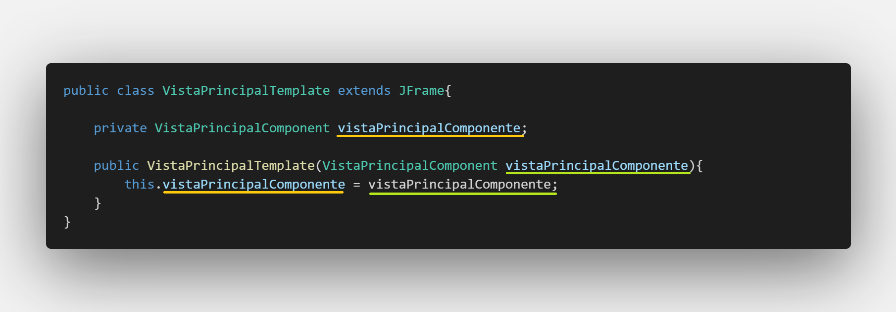
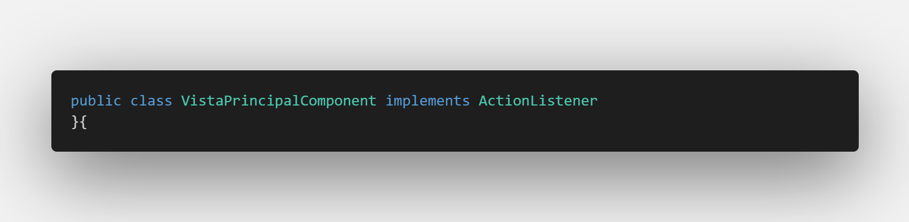
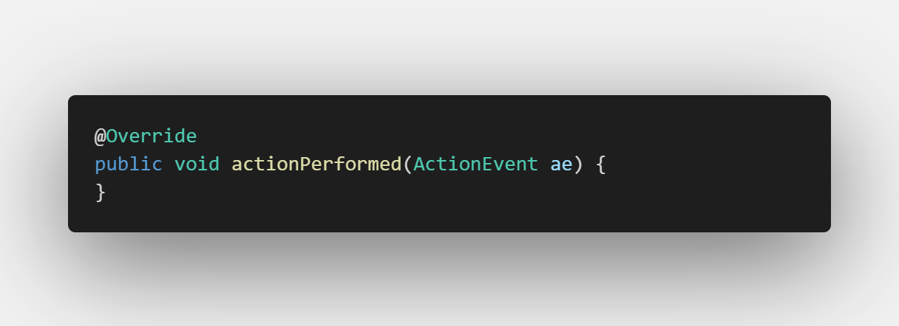
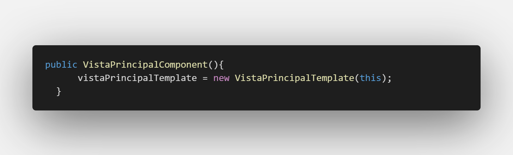
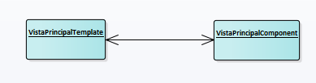
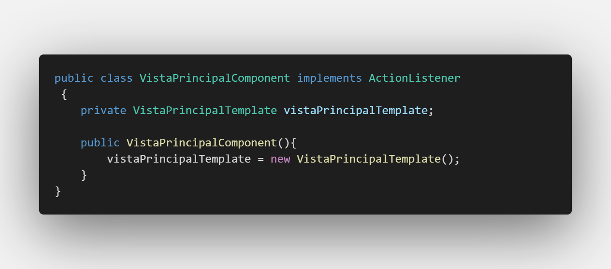
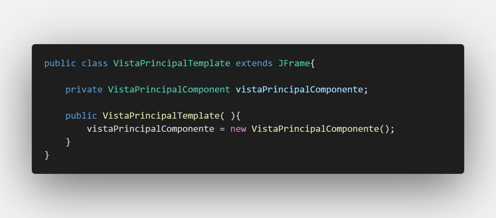
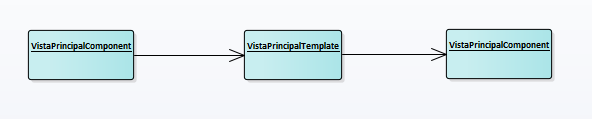

# Interfaz Grafica en Java

Curso propuesto por el grupo de trabajo Semana de Ingenio y Diseño (**SID**) de la Universidad Distrital Francisco Jose de Caldas.

## Monitor

**Cristian Felipe Patiño Caceres** - Estudiante de Ingenieria de Sistemas de la Universidad Distrital Francisco Jose de Caldas

# Clase 1

## Objetivos

### Objetivos Principales

- Explicar los temas principales y alcances del curso dejando claro que se quiere obtener al finalizar el curso.

  - Para los estudiantes de la carrera de ingenieria de sistemas se explicara ademas como sera el sistema de notas para la obtencion del grupo de trabajo.

- Explicar Concepto de Objetos y aterrizarlo a Objetos para UI
- Explicar la estructura basica de una clase UI en Java

### Objetivos Secundarios

- Mostrar proyectos destacados realizados por estudiantes que han pasado anteriormente por el curso.
- Mostrar propuestas de trabajo para escoger como proyecto del curso.
- Explicar la conformacion de grupos y eleccion de proyectos
- Realizar un Diagnostico de como se sienten los aspirantes del curso

# Introduccion y Alcance de Curso

## Tematicas

A continuacón se muestran las tematicas que se dictaran en el curso.

  

Aunque las tematicas anteriores son importantes y fundamentales, considero que algo mas importante que se quiere enseñar es la perspectiva de una arquitectura para la construccion de nuestras apicaciones graficas de los clientes.

  

El anterior esquema esta basado en Frameworks y Librerias muy usados en el entorno del desarrollo Frontend y su enfoque da una vision organizada y estandarizada de como trabajar con las aplicaciones cliente. Se busca aterrizar esos conceptos utilizando el lenguaje Java para aplicaciones de escritorio, esto ademas de permitir la creacion de aplicaciones organizadas y estandarizadas ayudará al entendimiento principal de las metodologias que estas propuestas realizan y asi pasar de una manera mas facil a estas tecnologias.

Para los estudiantes que quieren obtener el grupo de trabajo como requisito de la carrera de Ingenieria de Sistemas a continuacion se muestra los porcentajes de notas que se realizaran:

  

## Alcances

A continuación se muestra algunos proyectos realizados por estudiantes que pasaron por el curso anteriormente:

  

  

  

# Definicion de Objeto y Objetos Graficos en Java

Para empezar se va hablar de la evolución de los datos en la programacion para explicar como se forma el concepto de Objetos. Si ya tiene conocimientos de POO se puede saltar esta explicacion y pasar a la parte de **Definicion de clase UI**

## Datos Primitivos

Primero tenemos los datos Primitivos, estos datos son la parte mas pequeña en cuanto a variables se refiere. Estos son tipos de datos que se encuentran en cualquier lenguaje de programación en la actualidad, en la imagen siguiente se ve alguno de estos mas la forma de declarar (en Java) y su respectiva Notacion.

  

Puede notarse que la declaracion consta de varias partes:

- **Tipo Acceso:** este se refiere a la forma en que los datos pueden obtenerse a traves de otros archivos (clases). Esta propiedad esta enfocada en el paradigma orientado a objetos e indica como las otras clases pueden acceder o no a ciertos atributos o metodos de la clase en construccion. Estos pueden ser:
  - **Publico:** Se puede acceder al atributo desde cualquier otro archivo (Clases).
  - **Privado:** Unicamente se puede acceder al atributo por medio del mismo archivo (Clase).
  - **Protegido:** Solo la clase y las hijas podran acceder al atributo.
- **Tipo de Dato Primitivo:** Simplemente el tipo de dato de toda la vida, puede ser int, String, float, char etc.
- **Variable:** Es el nombre con el que se maneja el tipo de dato, puede tener el nombre que uno decida darle, salvo algunas excepciones como iniciar con numero etc.
- **Valor inicial:** Es el valor que puede tomar una variable una vez se declare, no es necesario que este valor se declare.

## Arreglos

Los datos evolucionan a un concepto mas grande, estos son los arreglos. Los arreglos son colecciones de datos pero estos tienen varias caracteristicas:

- **Unico tipo de dato:** Estos solo pueden contener un tipo de dato, esto quiere decir que si un arreglo contiene n datos estos datos deben ser del mismo tipo dato, por ejemplo un arreglo de enteros no puede contener numeros flotantes, un arreglo de Strings no puede contener numeros etc.
- **Tamaño estatico:** Estos tienen un tamaño inicial y no es posible cambiar el tamaño de este, si un arreglo de enteros inicia con un espacio de 30 tendra esa capacidad y no se puede cambiar.
- **Dimensiones:** Estos pueden tener varias dimensiones que se deben indicar cuando se declara el arreglo y esta dimension tampoco podra ser cambiada.
  - **1 dimension:** Los arreglos de una dimension son conocidos como vectores
  - **2 dimensiones** Los arreglos de 2 dimensiones son conocidos como Matrices
  - **n dimensiones** Los arreglos pueden tener n dimensiones estos arreglos normalmente se entienden como una matriz que contiene matrices o vectores dentro y asi sucesivamente. Java no soporta de forma normal este tipo de arreglos pero en Python por ejemplo es comun trabajar con arreglos de este tipo.

  

Se puede notar que existen varias partes importantes a la hora de declarar que aparecen:

- **Dimension de arreglo:** Se debe denotar la dimension del arreglo con parentesis cuadrados []
- **Inicializacion de Arreglo:** Esta puede ser de varias formas y tampoco es obligatorio realizar en la declaracion sin embaro es importante denotar que una vez se inicializa un arreglo se debe indicar el tamaño que tendra o en efecto el contenido que este tendra.

## Estructuras de datos

Una estructura de datos es un tipo de dato que tiene la capacidad de contener otros datos, a diferencia de un arreglo puede contener datos de diferentes tipos, incluso el concepto es tan amplio que tiene la capacidad de contener arreglos. Otro aspecto importante y que da lugar a un area entera de investigacion es la capacidad que tiene una estructura de datos para contener otra estructura. Esto da la creacion de listas, pilas, colas y arboles.

  

Notece que en la declaracion ha cambiado algo importante:

- **Tipo de dato:** El tipo de dato ya no es convencional, no es una palabra clave del lenguaje (int, String, floar etc.) sino que es un tipo de dato que tendra el nombre de la estructura creada, esto quiere decir que al crear una estructura de datos se esta creando tambien un tipo de dato y se puede manipular mediante una variable. Este concepto se suele llamar como **tipo de dato abstracto**.
- **Inicializar estructura:** En Java el concepto de estructuras esta implementado con el conepto de objetos asi que no es posible dejar un ejemplo claro, sin embargo en lenguajes como C o C++ se puede inicializar como se ve en la imagen.

## Objetos

Los objetos son tomados del concepto de las estructuras de datos, sin embargo estos tienen unas caracteristicas que lo diferencian de estas:

- **Funcionalidades:** A diferencia de las estructuras de datos un objeto tiene una serie de **metodos** (funciones) que le proporcionan comportamiento a este. Tal concepto es importante y por lo general son los metodos el medio por el cual un objeto interactua con otro.

  
  
Ejemplo de metodos encargados de obtener y configurar un atributo nombre

- **Clases:** La clase es la representacion en codigo de un objeto, es en esta donde se definen sus atributos, comportamientos, entornos y accesibilidad. El objeto es entonces la ejemplificacion de una clase.
- **Nuevos terminos:** Cuando una variable es global para la clase (existe para todo el entorno) normalmente se suele referir a esta como **atributo**, si una variable por ejemplo es creada dentro de un metodo se le sigue considerando variable unicamente. Las funciones que hacen parte de la clase ahora se conocen como **metodos**.
- **Entornos:** Un entorno es un contexto que esta aislado del resto, un metodo es un ejemplo de entorno, si una variable es creada dentro de él sera conocida solo para ese entorno, si otro metodo trata de manejar esa variable no existira. Una clase tambien es un entorno y a su vez contiene otros entornos (metodos). Esto quiere decir que sus atributos y metodos solo existen en dicha clase, si se quiere acceder desde otra clase a alguna funcionalidad o atributo de este se debe tener en cuenta el tipo de acceso explicado previamente en este documento.
- **Constructor:** Entre sus metodos una clase tiene por defecto un Constructor. Este metodo es la funcion por la cual otra clase podra realizar una ejemplificacion del objeto. El contructor habitualmente tiene el mismo nombre que la clase.

  
  
Ejemplo de una clase que representa los atributos y comportamiento de un objeto Casa con sus respectivas partes explicadas

A continuación se ve el ejemplo de una clase y como crear el objeto.

  

Se puede ver que en la declaracion de un objeto ocurren dos cosas interesantes:

- **Tipo de dato:** Al igual que una estructura de datos el tipo de dato ahora es abstracto y es igual al nombre que se deje en la clase.
- **Variable (Objeto):** El nombre de la variable que se coloca cuando se esta declarando es el objeto en si. Esta variable es entonces el medio para acceder a los atributos y funcionalidades creadas en la clase.
- **Ejemplificacion:** Para poder interactuar con el objeto es necesario inicializar esta variable, una palabra apropiada para esta accion es ejemplificacion (algunas veces mal llamada instanciacion). Lo que se hace realmente, es llamar a su metodo **constructor** y de esta forma queda listo el objeto para ser usado.

Una cosa a resaltar es el acceso a los atributos y metodos, puede notarse que al intentar acceder a la variable **numero** de la clase no es posible acceder. Esto debido a que este atributo es de acceso **privado**.

  

Para explicar mejor el concepto de objetos podemos ver en la imagen anterior dos clases, algo a resaltar es que todos los atributos son privados y los metodos son publicos en ambas clases, esto generalmente debe realizarse por principios del paradigma orientado a objetos.

Dentro de la clase carro entre uno de sus atributos esta el objeto Motor. Tenemos que ejemplificar el objeto antes de acceder a sus metodos y este se hace dentro del constructor para este caso (la ejemplificacion del objeto se puede realizar en cualquier parte del codigo). Una vez el objeto este listo se pueden acceder a sus funcionalidades como por ejemplo **encender()**. Mas adelante en otra parte del codigo de la clase **Carro** por ejemplo en el metodo **arrancar()** se necesita obtener la informacion del cilindraje del motor, puede notarse que el atributo **cilindraje** de la clase **Motor** es privada pero por medio de su metodo **devolverCilindraje()** este devolvera el valor y se igualaria a la variable creada para el proposito del metodo arrancar.

  

Un objeto grafico UI no es mas que clases creadas por los desarrolladores de Java con los que podremos interactuar a traves de la ejemplificacion de su objeto, se puede notar que al igual que una clase comun este tiene atributos y metodos por los cuales se puede acceder, con estas funcionalidades es posible mostrar una interfaz de usuario.

# Definicion de Clase para UI

Para la preparacion de una clase para UI se debe hablar del concepto de **componente**, un componente esta conformado por 2 clases:

- Una clase **Tempate** que se encarga unicamente de la muestra por pantalla de los objetos graficos y con los que interactuara el usuario.
- Una clase **component** que se encargara de la logica que soporta la clase template incluyendo la llamadas a servicios y la gestion de eventos.

Cada una de estas clases tiene sus caracteristicas y sera explicadas a continuacion.

## Clase Template

Esta clase se encargara unicamente de mostrar en pantalla las diferentes interfaces graficas con las que el usuario interactuara y mostrar los valores obtenidos de la logica realizada por la clase component. Se caracteriza por:

- Hereda de una clase **JFrame** esto le dara propiedades graficas a nuestra clase para ser mostrada al usuario.

  

- Importara las librerias necesarias para configurar objetos graficos en pantalla.
- Recibe como parametro en el constructor un objeto de la clase component y la iguala a un objeto creado de la misma referencia, esta tecnica es llamada **inyeccion de dependencia**.

  

* Como propuesta de estandar en este curso la configuracion de objetos graficos se realizata dentro del metodo **Constructor** sin embargo si se quiere configrurar estos objetos en metodos separados no hay problema.

  

En la imagen anterior se puede ver una serie de cofiguraciones, estas configuraciones dan caracteristicas a la ventana y esto es posible gracias a la herencia a la clase **JFrame** cada configuracion tiene su proposito:

- **setDefaultCloseOperation:** Recibe en parametro configuraciones Java. Le indica al compilador que una vez la ventana sea cerrada el programa dejara de correr, esto lo hace gracias al parametro recibido **EXIT_ON_CLOSE**
- **setSize:** Recibe como parametros un par de enteros. Le da propiedades de ancho y alto a nuestra ventana, en este caso nuestra ventana ocupara 1200 pixeles de ancho y 700 de alto.
- **setLocationRelativeTo:** Recibe como parametro la clase que quiere ser posicionada. le indica al sistema que nuestra ventana se posicione en el centro del monitor, el **this** como parametro indica que esta clase es la ventana que se quiere dejar centrada.
- **setLayout** Recibe por parametro el Layout que quiera ser utilizado para posicionamiento. Java maneja el posicionamiento de sus objetos graficos por medio de Layouts, este posicionamiento es algo confuso de entender cuando se esta empezando por lo que por ahora es mejor dejarlo **null** y ser nosotros mismos los que nos encarguemos del posicionamiento de nuestros objetos graficos.
- **setVisible** Recibe por parametro un booleano. Esta configuracion le indica al sistema que muestre la ventana en patalla, notese que se deja de ultimas ya que primero se deben configurar la ventana y los objetos graficos y finalmente mostrar en pantalla.

Existen otros metodos de configuracion en nuestras ventanas que podrian ser de utilidad como por ejemlo.

- **setUndecorated** Recibe por parametro un booleano y si se entrega como **true** este quitara la barra que por defecto crea Java, sin embargo esto quitara los botones encargados de cerrar, minimizar o expandir la ventana, tambien quitara la propiedad de arrastre por lo que nosotros mismos tendremos que crear esas funcionalidades en el futuro.

* **getContentPane().setBackground** recibe por parametro un objeto de tipo Color y le da el color de fondo a nuestra ventana, se debe llamar al panel contenedor para poder ver reflejado el color de fondo, esto pasa unicamente con las clases **JFrame**

## Clase Component

Esta clase se encarga de manejar toda la logica que la clase template podria necesitar, esta puede incluir manejo de eventos (cuando se oprime un boton, cuando se da click con el Mouse, cuando se oprime una tecla etc.) manejo de servicios, manejo de informacion etc.
Tambien tiene ciertas Caracteristicas como:

- Puede implementar las interfaces que proporcionan la escucha de eventos, por ejemplo un **ActionListener** que se activa cuando el usuario oprime un boton, de ser necesario implementa otras interfaces que gestionan otro tipo de eventos.

  

- Cuando se implemente cualquier interfaz esta pedira que por defecto se implementen tambien los metodos en la clase asi que debe realizarse, en este caso la Interfaz **ActionListener** exige la implementacion del metodo **actionPerformed**, es en este metodo donde se gestionara una accion cada que el usuario de click a un boton.

  

- Se tiene un objeto del tipo **template** y para ejemplificar este objeto se debe enviar como parametro una referencia a eta clase, para eso usamos la palabra **this**
  que indica que se esta enviando como parametro a ella misma y asi completar la inyeccion de dependencia.

  

## Explicacion Inyeccion de dependencia

Esta inyeccion se hace de esta forma para tener una comunicacion permanente entre las dos clases de forma bidireccional. Asi cuando la clase template necesite algo de la logica de la clase component podra hacerlo a traves de su objeto y de igual manera cuando la clase component quiera enviar informacion a la interfaz grafica podra hacerlo a traves de su objeto de esta.
A continuacion se puede ver un esquema general de un componente UI.

  

Visto esto en objetos en memoria se ve de la siguiente manera, y se puede denotar una comunicacion directa entre los objetos de forma bidireccional:

  

Una forma diferente de hacer esto (pero erronea) seria la de la ejemplificacion del objeto de la clase contraria de forma individual de la siguiente manera:

- En la clase VistaPrincipalComponent:

  

- En la clase VistaPrincipalTemplate:

  

De esta forma se podria pensar que se realizo de manera correcta un canal de comunicacion entre ambas clases, sin embargo si miramos el modelo de objetos podemos darnos cuenta que no es asi:

  

Lo que pasa en realidad es que la clase **VistaPrincipalComponent** crea un objeto de tipo **VistaPrincipalTemplate** y esta a su vez crea otro objeto de tipo **VistaPrincipalComponent** por lo que ahora en tiempo de ejecucion hay dos objetos de la misma clase y no hay una sola comunicacion directa entra ambos objetos.

# Actividades

- Realizar el formulario Diagnostico de Google enviado por correo electronico.
- Realizar la elección de proyecto de curso y enviarla por medio del formulario de Google.
- Realizar la conformacion del grupo con quien se realizara el proyecto (2 personas).
- Realizar un ejemplo de un componente UI con explicación de cada parte de cada una de sus dos clases.
