# Interfaz Gráfica en Java

Curso propuesto por el grupo de trabajo Semana de Ingenio y Diseño (**SID**) de la Universidad Distrital Francisco Jose de Caldas.

## Monitor

**Cristian Felipe Patiño Cáceres** - Estudiante de Ingeniería de Sistemas de la Universidad Distrital Francisco Jose de Caldas

# Clase 1

## Objetivos

### Objetivos Principales

- Explicar los temas principales y alcances del curso dejando claro que se quiere obtener al finalizar el curso.

  - Para los estudiantes de la carrera de ingeniería de sistemas se explicara ademas como sera el sistema de notas para la obtención del grupo de trabajo.

- Explicar Concepto de Objetos y comparar con el concepto de Objetos para UI
- Explicar la estructura básica de una clase UI en Java

### Objetivos Secundarios

- Mostrar proyectos destacados realizados por estudiantes que han pasado anteriormente por el curso.
- Mostrar propuestas de trabajo para escoger como proyecto del curso.
- Explicar la conformación de grupos y elección de proyectos
- Realizar un Diagnostico de como se sienten los aspirantes del curso

# Introducción y Alcance de Curso

## Temáticas

A continuación se muestran las temáticas que se dictaran en el curso.

  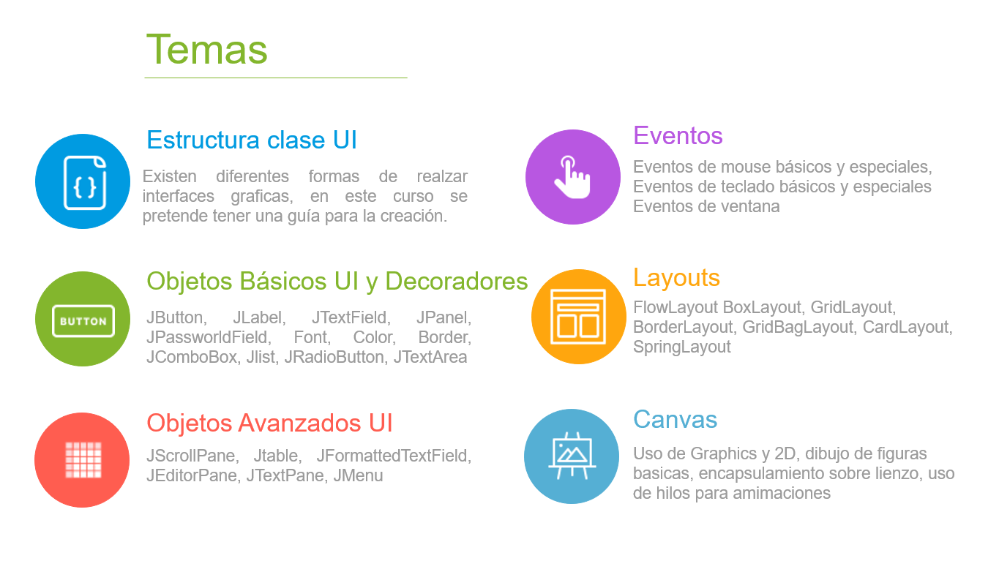

Aunque las temáticas anteriores son importantes y fundamentales, considero que algo mas importante que se quiere enseñar es la perspectiva de una arquitectura para la construcción de nuestras aplicaciones gráficas de los clientes.

  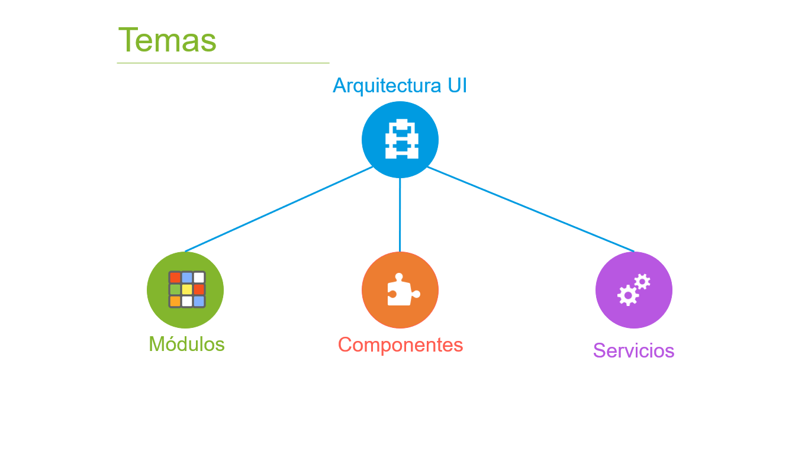

El anterior esquema esta basado en Frameworks y Librerías muy usados en el entorno del desarrollo Frontend y su enfoque da una vision organizada y estandarizada de como trabajar con las aplicaciones cliente. Se busca aterrizar esos conceptos utilizando el lenguaje Java para aplicaciones de escritorio, esto ademas de permitir la creación de aplicaciones organizadas y estandarizadas ayudará al entendimiento principal de las metodologías que estas propuestas realizan y asi pasar de una manera mas fácil a estas tecnologías.

Para los estudiantes que quieren obtener el grupo de trabajo como requisito de la carrera de Ingeniería de Sistemas a continuación se muestra los porcentajes de notas que se realizaran:

  

## Alcances

A continuación se muestra algunos proyectos realizados por estudiantes que pasaron por el curso anteriormente:

  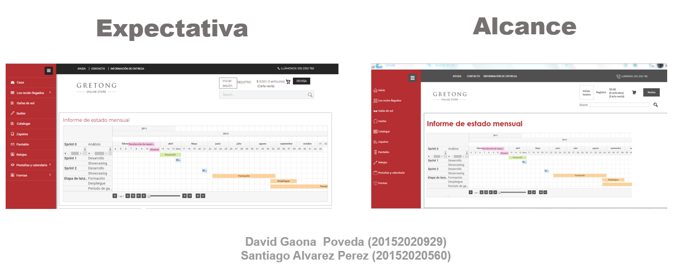

  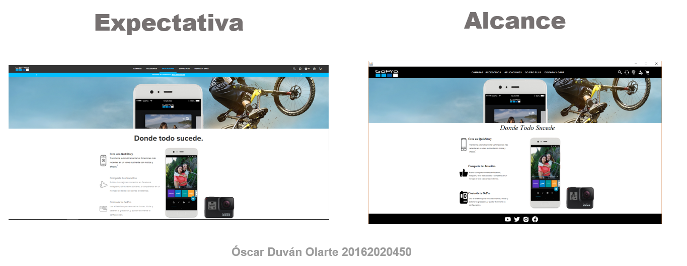

  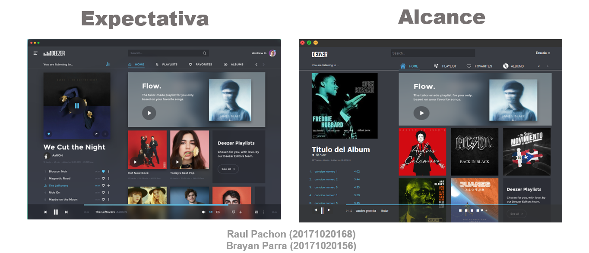

# Definición de Objeto y Objetos Gráficos en Java

Para empezar se va hablar de la evolución de los datos en la programación para explicar como se forma el concepto de Objetos. Si ya tiene conocimientos de POO se puede saltar esta explicación y pasar a la parte de **Definición de clase UI**

## Datos Primitivos

Primero tenemos los datos Primitivos, estos datos son la parte mas pequeña en cuanto a variables se refiere. Estos son tipos de datos que se encuentran en cualquier lenguaje de programación en la actualidad, en la imagen siguiente se ve alguno de estos mas la forma de declarar (en Java) y su respectiva Notación.

  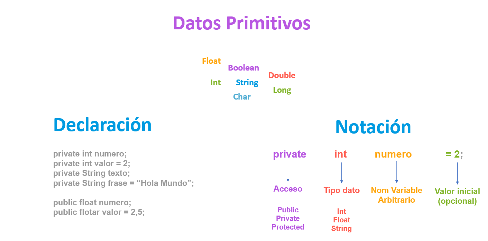

Puede notarse que la declaración consta de varias partes:

- **Tipo Acceso:** este se refiere a la forma en que los datos pueden obtenerse a traves de otros archivos (clases). Esta propiedad esta enfocada en el paradigma orientado a objetos e indica como las otras clases pueden acceder o no a ciertos atributos o métodos de la clase en construcción. Estos pueden ser:
  - **Publico:** Se puede acceder al atributo desde cualquier otro archivo (Clases).
  - **Privado:** Unicamente se puede acceder al atributo por medio del mismo archivo (Clase).
  - **Protegido:** Solo la clase y las hijas podrán acceder al atributo.
- **Tipo de Dato Primitivo:** Simplemente el tipo de dato de toda la vida, puede ser int, String, float, char etc.
- **Variable:** Es el nombre con el que se maneja el tipo de dato, puede tener el nombre que uno decida darle, salvo algunas excepciones como iniciar con numero etc.
- **Valor inicial:** Es el valor que puede tomar una variable una vez se declare, no es necesario que este valor se declare.

## Arreglos

Los datos evolucionan a un concepto mas grande, estos son los arreglos. Los arreglos son colecciones de datos pero estos tienen varias características:

- **Único tipo de dato:** Estos solo pueden contener un tipo de dato, esto quiere decir que si un arreglo contiene n datos estos datos deben ser del mismo tipo dato, por ejemplo un arreglo de enteros no puede contener números flotantes, un arreglo de Strings no puede contener números etc.
- **Tamaño estático:** Estos tienen un tamaño inicial y no es posible cambiar el tamaño de este, si un arreglo de enteros inicia con un espacio de 30 tendrá esa capacidad y no se puede cambiar.
- **Dimensiones:** Estos pueden tener varias dimensiones que se deben indicar cuando se declara el arreglo y esta dimension tampoco podrá ser cambiada.
  - **1 dimension:** Los arreglos de una dimension son conocidos como vectores
  - **2 dimensiones** Los arreglos de 2 dimensiones son conocidos como Matrices
  - **n dimensiones** Los arreglos pueden tener n dimensiones estos arreglos normalmente se entienden como una matriz que contiene matrices o vectores dentro y asi sucesivamente. Java no soporta de forma normal este tipo de arreglos pero en Python por ejemplo es común trabajar con arreglos de este tipo.

  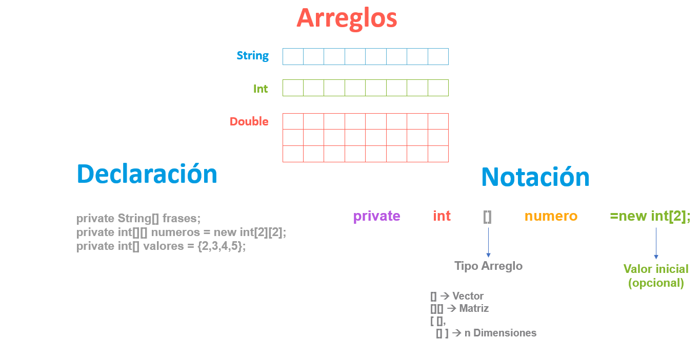

Se puede notar que existen varias partes importantes a la hora de declarar que aparecen:

- **Dimension de arreglo:** Se debe denotar la dimension del arreglo con paréntesis cuadrados []
- **Inicialización de Arreglo:** Esta puede ser de varias formas y tampoco es obligatorio realizar en la declaración sin embargo es importante denotar que una vez se inicializa un arreglo se debe indicar el tamaño que tendrá o en efecto el contenido que este tendrá.

## Estructuras de datos

Una estructura de datos es un tipo de dato que tiene la capacidad de contener otros datos, a diferencia de un arreglo puede contener datos de diferentes tipos, incluso el concepto es tan amplio que tiene la capacidad de contener arreglos. Otro aspecto importante y que da lugar a un area entera de investigación es la capacidad que tiene una estructura de datos para contener otra estructura. Esto da la creación de listas, pilas, colas y arboles.

  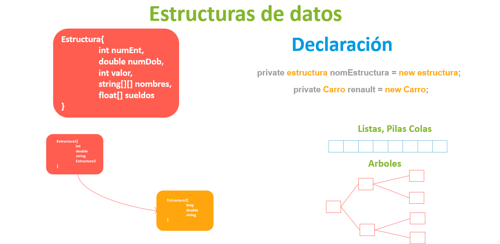

Nótese que en la declaración ha cambiado algo importante:

- **Tipo de dato:** El tipo de dato ya no es convencional, no es una palabra clave del lenguaje (int, String, float etc.) sino que es un tipo de dato que tendrá el nombre de la estructura creada, esto quiere decir que al crear una estructura de datos se esta creando también un tipo de dato y se puede manipular mediante una variable. Este concepto se suele llamar como **tipo de dato abstracto**.
- **Inicializar estructura:** En Java el concepto de estructuras esta implementado con el concepto de objetos asi que no es posible dejar un ejemplo claro, sin embargo en lenguajes como C o C++ se puede inicializar como se ve en la imagen.

## Objetos

Los objetos son tomados del concepto de las estructuras de datos, sin embargo estos tienen unas características que lo diferencian de estas:

- **Funcionalidades:** A diferencia de las estructuras de datos un objeto tiene una serie de **métodos** (funciones) que le proporcionan comportamiento a este. Tal concepto es importante y por lo general son los métodos el medio por el cual un objeto interactúa con otro.

  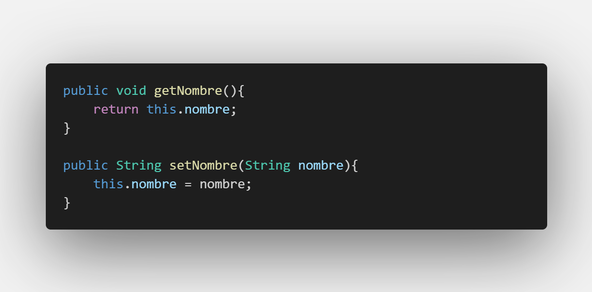
  
Ejemplo de métodos encargados de obtener y configurar un atributo nombre

- **Clases:** La clase es la representación en código de un objeto, es en esta donde se definen sus atributos, comportamientos, entornos y accesibilidad. El objeto es entonces la ejemplificación de una clase.
- **Nuevos términos:** Cuando una variable es global para la clase (existe para todo el entorno) normalmente se suele referir a esta como **atributo**, si una variable por ejemplo es creada dentro de un método se le sigue considerando variable unicamente. Las funciones que hacen parte de la clase ahora se conocen como **métodos**.
- **Entornos:** Un entorno es un contexto que esta aislado del resto, un método es un ejemplo de entorno, si una variable es creada dentro de él sera conocida solo para ese entorno, si otro método trata de manejar esa variable no existirá. Una clase también es un entorno y a su vez contiene otros entornos (métodos). Esto quiere decir que sus atributos y métodos solo existen en dicha clase, si se quiere acceder desde otra clase a alguna funcionalidad o atributo de este se debe tener en cuenta el tipo de acceso explicado previamente en este documento.
- **Constructor:** Entre sus métodos una clase tiene por defecto un Constructor. Este método es la función por la cual otra clase podrá realizar una ejemplificación del objeto. El constructor habitualmente tiene el mismo nombre que la clase.

  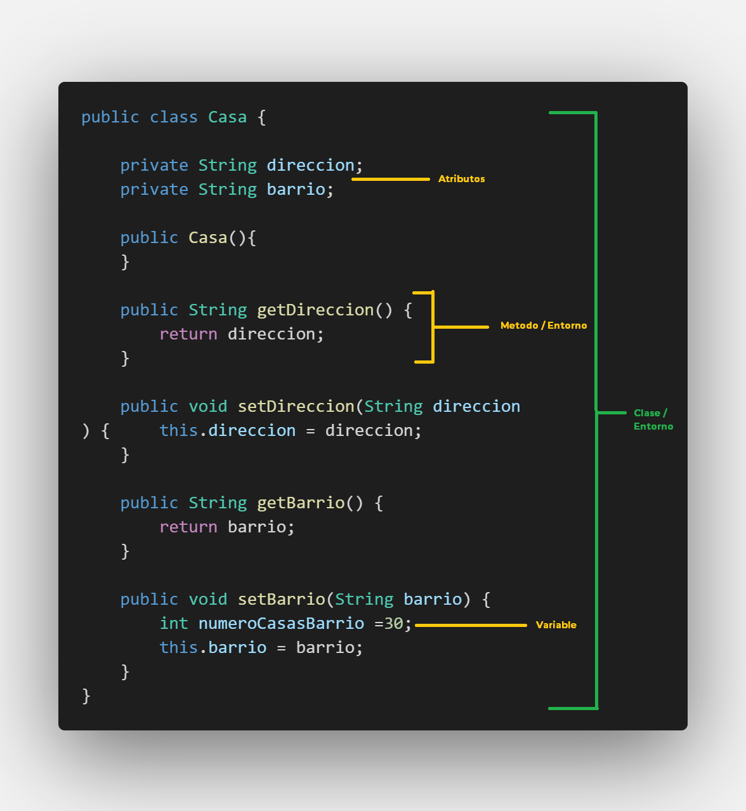
  
Ejemplo de una clase que representa los atributos y comportamiento de un objeto Casa con sus respectivas partes explicadas

A continuación se ve el ejemplo de una clase y como crear el objeto.

  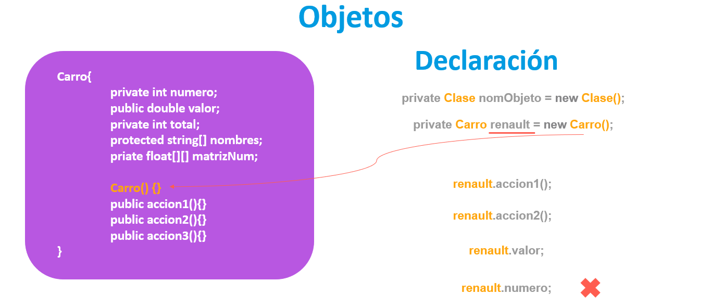

Se puede ver que en la declaración de un objeto ocurren dos cosas interesantes:

- **Tipo de dato:** Al igual que una estructura de datos el tipo de dato ahora es abstracto y es igual al nombre que se deje en la clase.
- **Variable (Objeto):** El nombre de la variable que se coloca cuando se esta declarando es el objeto en si. Esta variable es entonces el medio para acceder a los atributos y funcionalidades creadas en la clase.
- **Ejemplificación:** Para poder interactuar con el objeto es necesario inicializar esta variable, una palabra apropiada para esta acción es ejemplificación (algunas veces mal llamada instanciación). Lo que se hace realmente, es llamar a su método **constructor** y de esta forma queda listo el objeto para ser usado.

Una cosa a resaltar es el acceso a los atributos y métodos, puede notarse que al intentar acceder a la variable **numero** de la clase no es posible acceder. Esto debido a que este atributo es de acceso **privado**.

  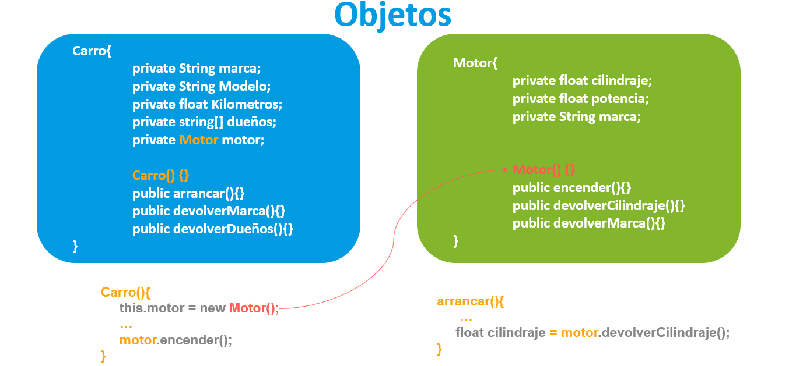

Para explicar mejor el concepto de objetos podemos ver en la imagen anterior dos clases, algo a resaltar es que todos los atributos son privados y los métodos son públicos en ambas clases, esto generalmente debe realizarse por principios del paradigma orientado a objetos.

Dentro de la clase carro entre uno de sus atributos esta el objeto Motor. Tenemos que ejemplificar el objeto antes de acceder a sus métodos y este se hace dentro del constructor para este caso (la ejemplificación del objeto se puede realizar en cualquier parte del código). Una vez el objeto este listo se pueden acceder a sus funcionalidades como por ejemplo **encender()**. Mas adelante en otra parte del código de la clase **Carro** por ejemplo en el método **arrancar()** se necesita obtener la información del cilindraje del motor, puede notarse que el atributo **cilindraje** de la clase **Motor** es privada pero por medio de su método **devolverCilindraje()** este devolverá el valor y se igualaría a la variable creada para el propósito del método arrancar.

  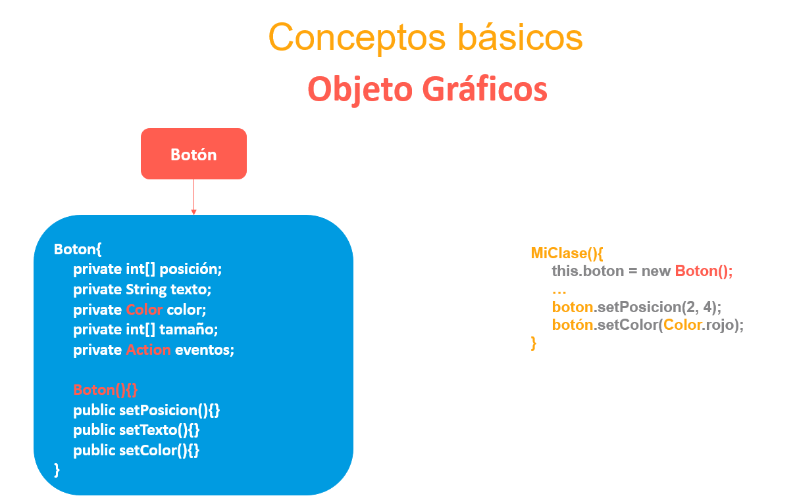

Un objeto gráfico UI no es mas que clases creadas por los desarrolladores de Java con los que podremos interactuar a traves de la ejemplificación de su objeto, se puede notar que al igual que una clase común este tiene atributos y métodos por los cuales se puede acceder, con estas funcionalidades es posible mostrar una interfaz de usuario.

# Definición de Clase para UI

En Java existen muchas formas de crear Interfaces gráficas y no existe en realidad un estándar para la creación de estas, en este curso se pretende trabajar de una manera estandarizada que no solo ayudara con la organización y buenas practicas de nuestro código, también se encarga de escribir un código entendible y mantenible para todos los demás y en especial los que somos parte del curso. Esta metodología no es la verdad absoluta y tampoco pretende ser rígida ya que se pueden tener ligeras variaciones.

- Nuestro proyecto inicia con un paquete por defecto **DefaultPackage** sin embargo es bueno crear nuestra carpeta raíz, en este caso se creara el paquete **app**.
- Es bueno separar nuestras vistas en paquetes separados, es por esto que dentro del paquete **app** creare un paquete llamado **VistaPrincipal** y dentro se crea la primera clase UI.
- Al crear una clase UI lo primero que se realiza es definir el nombre de la clase, por motivos de estándar se colocara el nombre de la clase (es arbitrario) seguido de la palabra **Template**. Así por ejemplo si quiero crear una clase llamada _VistaPrincipal_ esta quedara entonces con el nombre **VistaPrincipalTemplate**, esto tiene su razón y mas adelante en el curso esta razón sera explicada.

  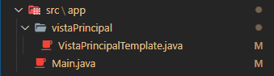

Puede se puede notar que en nuestro paquete raíz **app**, existe otra clase Main.java, esta clase es la que ejecuta el programa. Desde esta clase llamamos a nuestra vista principal para poder ser vista.

  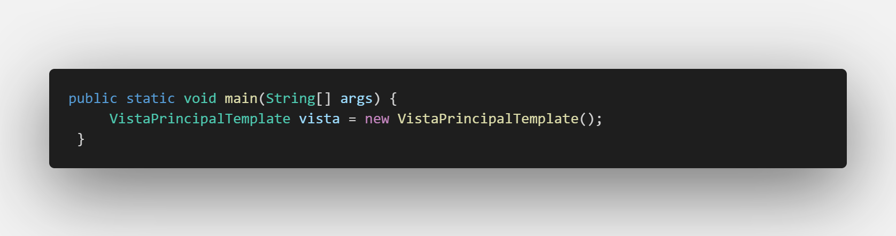
  
Creación y ejemplificación del objeto VistaPrincipal desde la Clase Main

Nuestra Clase Template tiene ciertas características que a continuación serán explicadas:

- Una clase **Tempate** que se encarga unicamente de la muestra por pantalla de los objetos gráficos y con los que interactuara el usuario. También mostrará los valores obtenidos de la lógica realizada por otras clases.
- **No** se encarga del manejo de eventos ni llamada de servicios ni operaciones lógicas, su responsabilidad se reduce a la muestra de interfaces Gráficas y muestra y recolección de información que el usuario necesite ver o que este recopile.
- Hereda de una clase **JFrame** esto le dará propiedades gráficas a nuestra clase para ser mostrada al usuario.

  

- Importara las librerías necesarias para configurar objetos gráficos en pantalla.
- Como propuesta de estándar en este curso la configuración de objetos gráficos se realizará dentro del método **Constructor** sin embargo si se quiere configurar estos objetos en métodos separados no hay problema.

  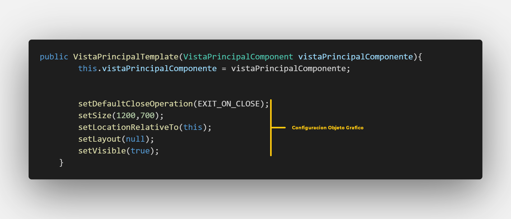

En la imagen anterior se puede ver una serie de configuraciones, estas le dan características a la ventana y esto es posible gracias a la herencia a la clase **JFrame**. Cada configuración tiene su propósito:

- **setDefaultCloseOperation:** Recibe en parámetro configuraciones Java. Le indica al compilador que una vez la ventana sea cerrada el programa dejara de correr, esto lo hace gracias al parámetro recibido **EXIT_ON_CLOSE**
- **setSize:** Recibe como parámetros un par de enteros. Le da propiedades de ancho y alto a nuestra ventana, en este caso nuestra ventana ocupara 1200 pixeles de ancho y 700 pixeles de alto.
- **setLocationRelativeTo:** Recibe como parámetro la clase que quiere ser posicionada. le indica al sistema que nuestra ventana se posicione en el centro del monitor, el **this** como parámetro indica que esta clase es la ventana que se quiere dejar centrada.
- **setLayout** Recibe por parámetro el Layout que quiera ser utilizado para posicionamiento. Java maneja el posicionamiento de sus objetos gráficos por medio de Layouts, este posicionamiento es algo confuso de entender cuando se esta empezando por lo que por ahora es mejor dejarlo **null** y ser nosotros mismos los que nos encarguemos del posicionamiento de nuestros objetos gráficos.
- **setVisible** Recibe por parámetro un booleano. Esta configuración le indica al sistema que muestre la ventana en pantalla, nótese que se deja de ultimas ya que primero se deben configurar la ventana y los objetos gráficos y finalmente mostrar en pantalla.

Existen otros métodos de configuración en nuestras ventanas que podrían ser de utilidad como por ejemplo.

- **setUndecorated** Recibe por parámetro un booleano y si se entrega como **true** este quitara la barra que por defecto crea Java, sin embargo esto quitara los botones encargados de cerrar, minimizar o expandir la ventana, también quitara la propiedad de arrastre por lo que nosotros mismos tendremos que crear esas funcionalidades en el futuro.

* **getContentPane().setBackground** recibe por parámetro un objeto de tipo Color y le da el color de fondo a nuestra ventana, se debe llamar al panel contenedor para poder ver reflejado el color de fondo, esto pasa unicamente con las clases **JFrame**

Cuando se quiera crear atributos estos deben ir al comienzo de la clase y generalmente serán privados como se hablo anteriormente. Es común que los atributos para una clase UI sean objetos gráficos por lo que muchas veces sera necesaria la importación de librerías que soporten la creación de estos objetos. Normalmente cuando se declaran estos objetos el editor de texto ayuda con la importación automática de estas librerías.

  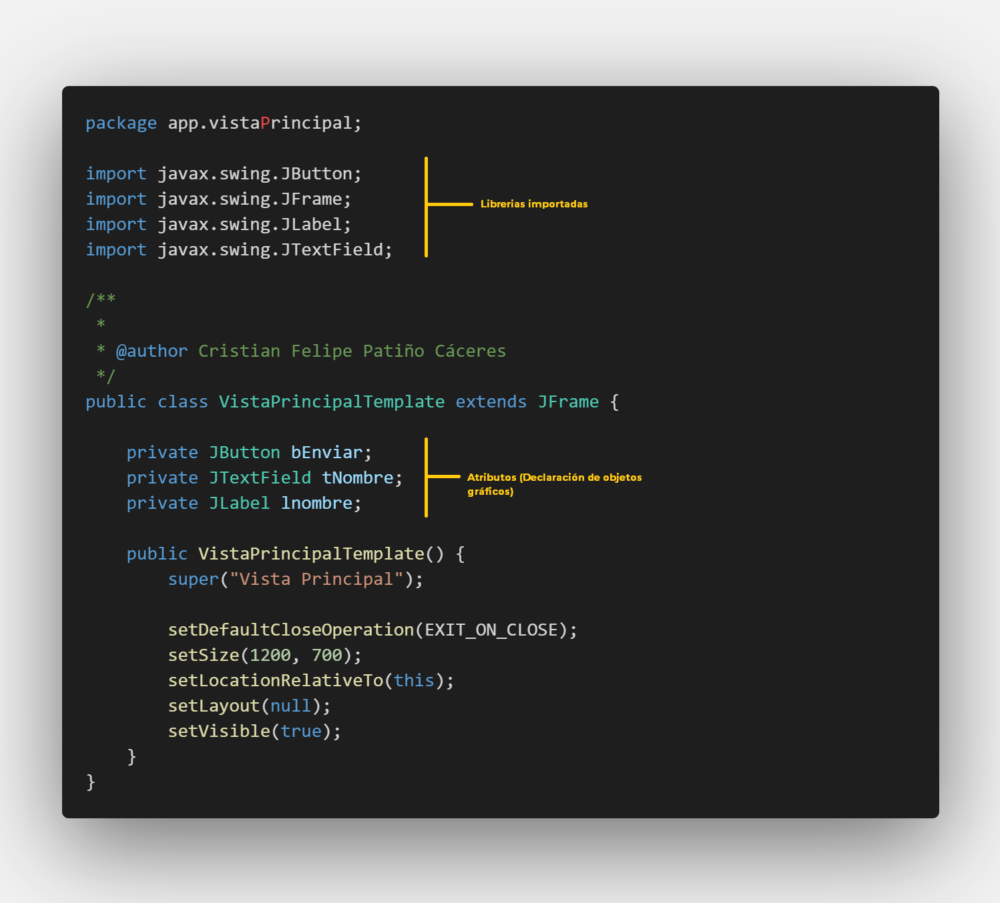
  
Clase VistaPrincipalTemplate con la declaración de objetos gráficos y la importación de sus respectivas librerías

# Resultado

El resultado obtenido hasta ahora después de la configuración inicial de nuestro componente es la siguiente:

  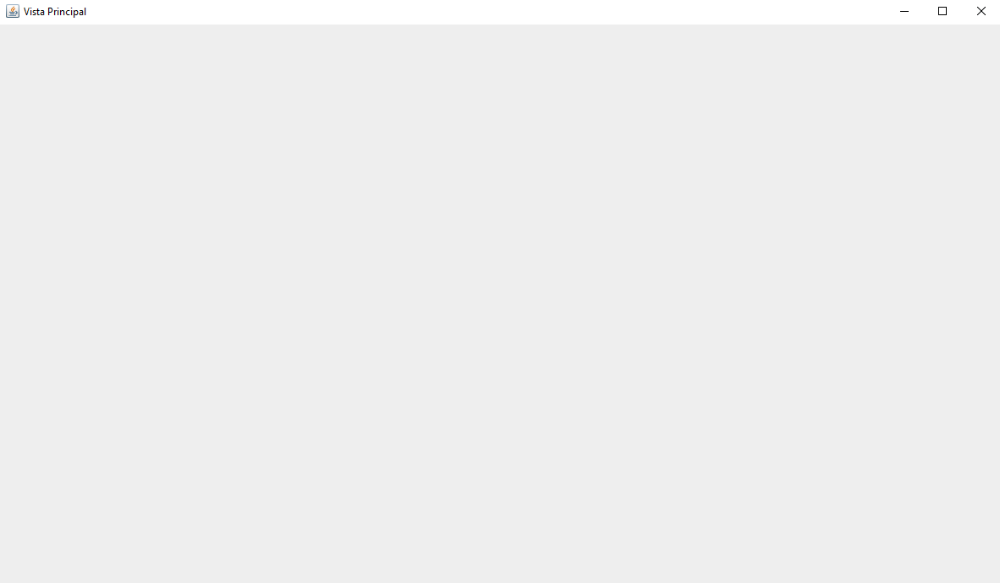

# Actividades

- Realizar el formulario Diagnostico de Google enviado por correo electrónico.
- Realizar la elección de proyecto de curso y enviarla por medio del formulario de Google.
- Realizar la conformación del grupo con quien se realizara el proyecto (2 personas).
- Realizar un ejemplo de una clase UI con explicación de cada parte.
